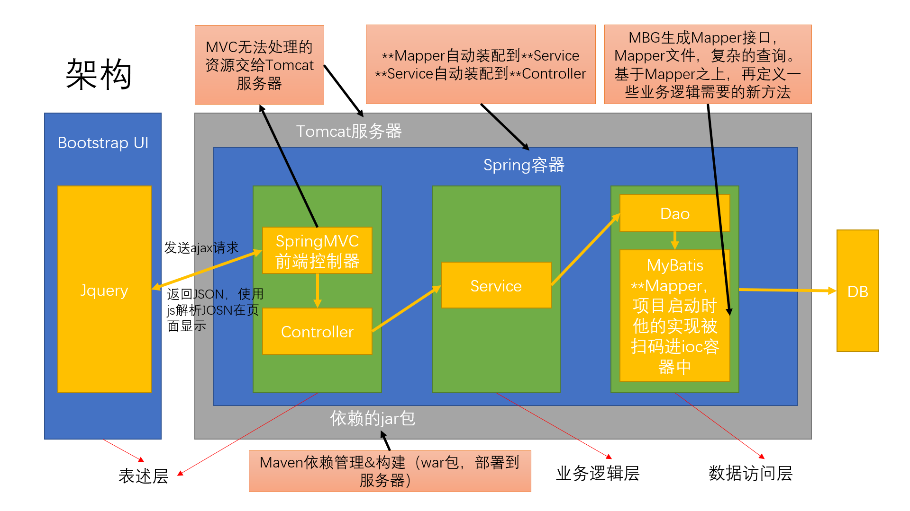
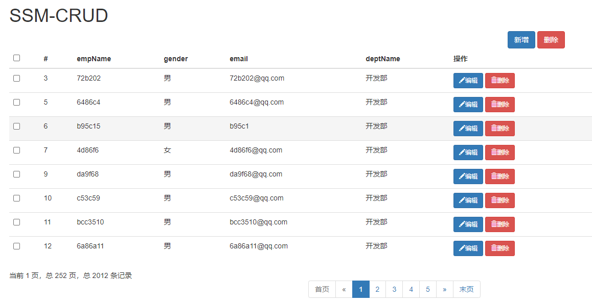
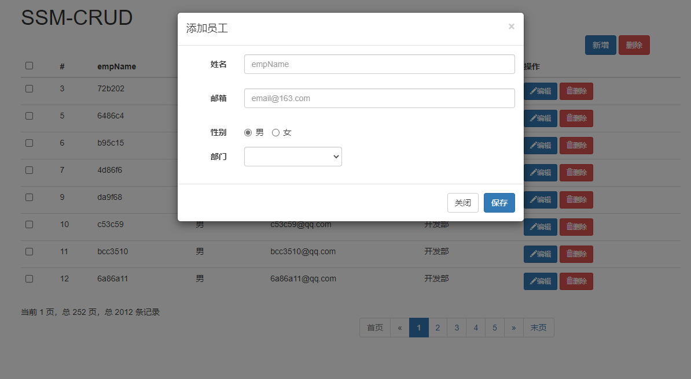

# ssm-curd

## 1. 说明

* 根据尚硅谷学习视频`尚硅谷SSM实战演练丨ssm整合快速开发CRUD`，使用`IDEA`编写

## 2. 功能分解

1. 增 **`@PostMapping("/emp")`**

   - 前端使用jquery校验
   - 后端提交保存前效验用户名是否存在 **@RequestMapping("/checkUser")**，提交保存后使用JSR303

   

1. 删 **`@DeleteMapping("/emp/{id}")`**

   - 单个删除员工

   - 批量删除员工

     

2. 查 **`@GetMapping("/emp")`**

   - 查询和分页显示

     

3. 改 **`@PutMapping("/emp/{empId}")`**

   - 根据员工id查询信息 **@GetMapping("/emp/{id}")**
   - 修改员工信息

## 2. 技术点

1. 基础框架-`SSM（Spring+SpringMVC+Mybatis）`
2. 数据库-`MySQL 8`
3. 服务器-`Tomcat 8`
4. 前端框架-`Bootstrap`
5. 视图渲染-`Thymeleaf`
6. 依赖管理-`Maven`
7. 分页查询-`Mybatis PageHelper`
8. 逆向工程-`Mybatis Generator`
9. 后端效验-`JSR303`

## 3. 页面图

